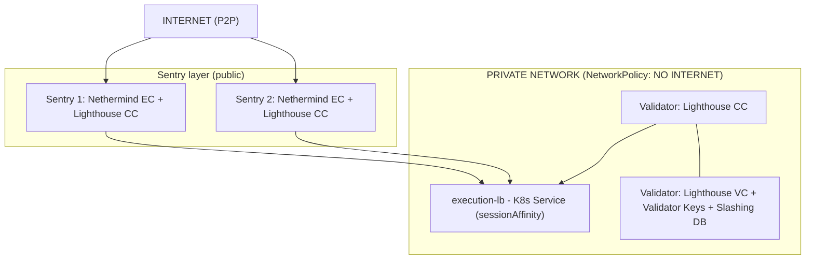

# Ethereum Validator Infrastructure - Quick Start

## Prerequisites

```bash
# Check dependencies
make check-deps
# Requires: docker, kind, kubectl, helm
```

## One-Command Deployment

### Option 1: Using Makefile (Recommended)

```bash
# Complete setup (cluster + secrets + deploy)
make setup

# Expected output:
# ✓ All dependencies found
# ✓ Cluster created
# ✓ Secrets initialized
# ✓ Deployment complete

# Check status
make status

# Access Grafana
make grafana-port-forward
# Open: http://localhost:3000 (admin/admin)
```

### Option 2: Manual Step-by-Step

```bash
# 1. Prepare disk (one-time, 5 minutes) - Optional for production
sudo ./scripts/reclaim-docker-lv-for-kind.sh

# 2. Create Kind cluster (2 minutes)
kind create cluster --name validator --config kind-config.yaml

# 3. Generate secrets (2 minutes)
./scripts/init-secrets-helm.sh

# Review generated secrets
ls -la secrets/
## Expected files:
# secrets/
# ├── jwt.hex                         # JWT for execution ↔ consensus
# └── validator-keys/
#     ├── deposit_data-*.json         # Deposit data for Ethereum
#     └── keystore-*.json             # Validator keystore

# Backup secrets
tar -czf secrets-backup-$(date +%Y%m%d).tar.gz secrets/

# 4. Deploy everything
./scripts/deploy-helm.sh

# 5. Watch it come up
kubectl get pods -n validators -w

# 6. Access monitoring
kubectl port-forward -n monitoring svc/grafana 3000:3000
# Open: http://localhost:3000 (admin/admin)
```

## Quick Reference - Makefile Commands

### Most Used Commands

```bash
# Setup & Deployment
make setup              # Complete setup (cluster + secrets + deploy)
make deploy             # Deploy infrastructure
make upgrade            # Upgrade existing deployment
make undeploy           # Remove deployment

# Monitoring
make status             # Show deployment status
make health-check       # Check all components
make logs               # Show logs from all components
make logs-follow COMPONENT=validator  # Follow specific logs

# Access Services
make grafana-port-forward       # http://localhost:3000
make prometheus-port-forward    # http://localhost:9090

# Rollback & Recovery
make rollback           # Rollback to previous version
make history            # Show deployment history

# Testing
make smoke-test         # Run smoke tests
make connectivity-test  # Test network connectivity

# Maintenance
make restart-validator  # Restart validator pod
make restart-all        # Restart all components

# Debugging
make debug-validator    # Shell into validator
make check-sync         # Check sync status
make check-peers        # Check peer count

# Cleanup
make clean              # Clean everything (cluster + secrets)
make kind-down          # Delete cluster only

# Help
make help               # Show all available commands
```

### Dashboard Import IDs

After accessing Grafana (admin/admin):

- **Dashboard ID 12900** - Lighthouse Consensus
- **Dashboard ID 16598** - Nethermind Execution
- **Dashboard ID 14371** - Validator Performance

---

## Architecture



## Verification Commands

### Check Everything is Running

```bash
kubectl get pods -n validators
# All should be Running

kubectl get endpoints -n validators execution-lb
# Should show 2 endpoints (both sentries)

kubectl get networkpolicies -n validators
# Should show 6 policies
```
