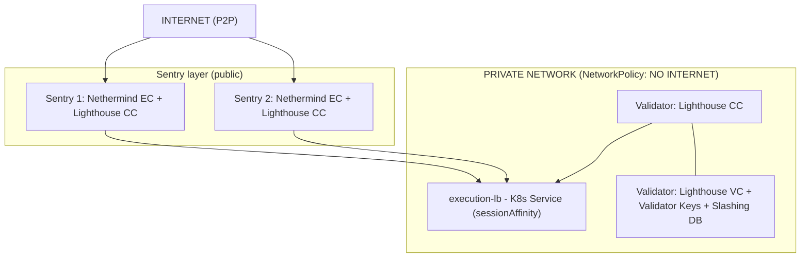

## One-Command Deployment

```bash
# 1. Prepare disk (one-time, 5 minutes)
sudo ./scripts/reclaim-docker-lv-for-kind.sh

# 2. Create Kind cluster (2 minutes)
kind create cluster --name validator --config kind-config.yaml

# 3. Generate secrets (2 minutes)
./scripts/init-secrets-helm.sh
# Review generated secrets
ls -la secrets/
## Expected files: 
# secrets/
# ├── jwt.hex                         # JWT for execution ↔ consensus
# └── validator-keys/
#     ├── deposit_data-*.json         # Deposit data for Ethereum
#     └── keystore-*.json             # Validator keystore
## Backup secrets
# tar -czf secrets-backup-$(date +%Y%m%d).tar.gz secrets/

# 4. Deploy everything
./scripts/deploy-helm.sh

# 5. Watch it come up
kubectl get pods -n validators -w

# 6. Access monitoring
kubectl port-forward -n validators svc/grafana 3000:3000
# Open: http://localhost:3000 (admin/admin), use dashboard or import 
#- Dashboard ID 12900 - Lighthouse Consensus
#- Dashboard ID 16598 - Nethermind Execution
#- Dashboard ID 14371 - Validator Performance
```

---

## Architecture



## Verification Commands

### Check Everything is Running

```bash
kubectl get pods -n validators
# All should be Running

kubectl get endpoints -n validators execution-lb
# Should show 2 endpoints (both sentries)

kubectl get networkpolicies -n validators
# Should show 6 policies
```
